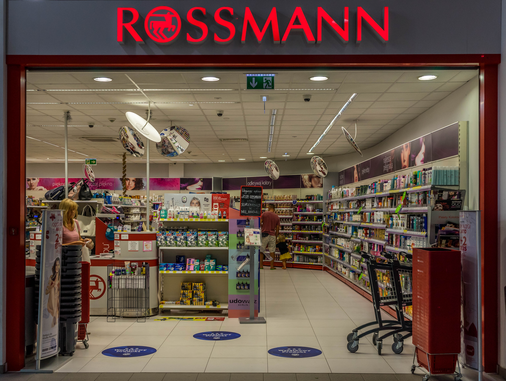

# Previsões de Vendas rede de drogaria Rossmann

O contexto a seguir é fictício, os dados foram retirados do Kaggle

Acesse o código do projeto aqui xxxxxxx

## 1. Problema de negócio.
Rossmann opera mais de 3.000 drogarias em 7 países europeus. Atualmente, os gerentes de loja da Rossmann têm a tarefa de prever suas vendas diárias com até seis semanas de antecedência. As vendas da loja são influenciadas por muitos fatores, incluindo promoções, competição, feriados escolares e estaduais, sazonalidade e localidade. Com milhares de gerentes individuais prevendo vendas com base em suas circunstâncias únicas, a precisão dos resultados pode ser bastante variada.

Nesse contexto, eu desenvolvi um modelo de Machine Learning com o objetivo de prever as vendas de cada loja para as próximas 6 semanas 

O resultado final pode se acessados via aplicativo Telegram

## 2. Premissas de negócios.
- Algumas lojas possuem NA na distância entre competidores, o motivo poderia ser que existem competições com lojas muito distante ou que não exista competidores. A solução encontrada foi substituir NA por 200.000 metros de distância
- Os dias em que as lojas estiveram fechadas foram retiradas da análise.
- Foram consideradas apenas as lojas que tiveram vendas maiores do que zero

### 2.1. Descrição dos dados
**Id** –  identificação de dados de uma loja em um determinado dia

**Store** -  ID único para cada loja

**Sales** - o volume de vendas em qualquer dia em uma determinada loja, isso que iremos prever para as próximas 6 semanas

**Customers** - o número de clientes em um determinado dia

**Open** - um indicador para saber se a loja estava aberta: 0 = fechada, 1 = aberta

**StateHoliday** - indica um feriado estadual. Normalmente todas as lojas, com poucas exceções, fecham nos feriados estaduais. Observe que todas as escolas fecham nos feriados e finais de semana. a = feriado, b = feriado da Páscoa, c = Natal, 0 = Nenhum

**SchoolHoliday** - indica se (loja, data) foi afetado pelo fechamento de escolas públicas
StoreType - diferencia entre 4 modelos de loja diferentes: a, b, c, d

**Assortment** - descreve um nível de sortimento: a = básico, b = extra, c = estendido

**CompetitionDistance** - distância em metros até a loja concorrente mais próxima

**CompetitionOpenSince** [Mês / Ano] - fornece o ano e mês aproximados em que o concorrente mais próximo foi aberto
Promo - indica se uma loja está fazendo uma promoção naquele dia

**Promo2** - Promo2 é uma promoção contínua e consecutiva para algumas lojas: 0 = a loja não está participando, 1 = a loja está participando

**Promo2Since** [Ano / Semana] - descreve o ano e a semana em que a loja começou a participar da Promo2

**PromoInterval** - descreve os intervalos consecutivos em que a Promo2 é iniciada, nomeando os meses em que a promoção é reiniciada. Por exemplo. "Fev, maio, agosto, novembro" significa que cada rodada começa em fevereiro, maio, agosto, novembro de qualquer ano para aquela loja

## 3. Estratégia de Solução
A estratégia utilizada para resolver esse desafio foi o método CRISP-DM:

Etapa 00. Entendimento do negócio: Buscar entender os reais motivos da necessidade de previsão de vendas. É a etapa mais importante para a solução corret

Etapa 01. Descrição dos dados: É preciso entender bem os atributos e dados  para fins de definir os objetivos do restante do processo. Como identificação de outliers e também métricas estatísticas básicas como: média, mediana, máximo, mínimo, intervalo, skewness, kurtosis e desvio padrão.

Etapa 02. Engenharia de recursos: A fim de melhor descrever o fenômeno a ser modelado, o objetivo dessa etapa é obter atributos a partir das variáveis originais

Etapa 03. Filtragem de dados: Eliminar colunas e linhas que não contenham informações e que não estarão disponíveis para a modelagem do negócio.

Etapa 04. Análise Exploratória de Dados: Explorar os dados e gerar diversas Hipóteses para validar e encontrar insights e as variaveis mais importantes a serem utilizadas no modelo de Machine Learning

Etapa 05. Preparação de dados: Transformar, balancear e regularizar os dados para aplicação no modelo de Machine  Learning

Etapa 06. Seleção de recursos: Seleção dos melhores atributos para treinar o modelo. Foi utilizado o algoritmo Boruta para fazer essa seleção

Etapa 07. Modelagem de Machine Learning: Foram utilizados os algoritmos de regressão linear para fazer o treinamento do modelo, usou tecnicas de cross validation para verificar o melhor resultado

Etapa 08. Hyperparameter Fine Tunning: O objetivo é Escolher os melhores valores para cada um dos parâmetros do modelo selecionado

Etapa 09. Converter o desempenho do modelo em valores comerciais: O objetivo é converter o resultado do modelo em valores de negócios

Etapa 10. Deploy do modelo em produção: O modelo foi publicado em nuvem no Heroku e acessado via bot no app do Telegram que possibilite consultar a previsão a qualquer momento pelo celular

## 4. Os 3 principais insights de dados
Hipótese 01:
Verdadeiro falso.
Hipótese 02:
Verdadeiro falso.
Hipótese 03:
Verdadeiro falso.

## 5. Modelo de Machine Learning aplicado

## 6. Desempenho do modelo de Machine Learning

## 7. Resultados de Negócios

## 8. Conclusões

## 9. Lições aprendidas

## 10. Próximos Passos