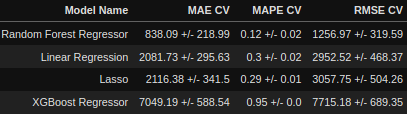

# Previsões de Vendas rede de drogaria Rossmann

O contexto a seguir é fictício, os dados foram retirados do [Kaggle](https://www.kaggle.com/c/rossmann-store-sales/data)

Para melhor visualização jupyter notebook accesse:
[nbviewer](https://nbviewer.org/github/RomuloCunhaLima/store_sales_Rossmann/blob/master/Rossmann_Notebook.ipynb)

## 1. Problema de negócio.
Rossmann opera mais de 3.000 drogarias em 7 países europeus. Atualmente, os gerentes de loja da Rossmann têm a tarefa de prever suas vendas diárias com até seis semanas de antecedência. As vendas da loja são influenciadas por muitos fatores, incluindo promoções, competição, feriados escolares e estaduais, sazonalidade e localidade. Com milhares de gerentes individuais prevendo vendas com base em suas circunstâncias únicas, a precisão dos resultados pode ser bastante variada.

Nesse contexto, eu desenvolvi um modelo de Machine Learning com o objetivo de prever as vendas de cada loja para as próximas 6 semanas. 

O resultado final pode se acessados via aplicativo Telegram.

## 2. Premissas de negócios
- Algumas lojas possuem NA na distância entre competidores, o motivo poderia ser que existem competições com lojas muito distante ou que não exista competidores. A solução encontrada foi substituir NA por 200.000 metros de distância.
- Os dias em que as lojas estiveram fechadas foram retiradas da análise.
- Foram consideradas apenas as lojas que tiveram vendas maiores do que zero.

### 2.1. Descrição dos dados
**Id** –  identificação de dados de uma loja em um determinado dia.

**Store** -  ID único para cada loja.

**Sales** - o volume de vendas em qualquer dia em uma determinada loja, isso que iremos prever para as próximas 6 semanas.

**Customers** - o número de clientes em um determinado dia.

**Open** - um indicador para saber se a loja estava aberta: 0 = fechada, 1 = aberta.

**StateHoliday** - indica um feriado estadual. Normalmente todas as lojas, com poucas exceções, fecham nos feriados estaduais. Observe que todas as escolas fecham nos feriados e finais de semana. a = feriado, b = feriado da Páscoa, c = Natal, 0 = Nenhum.

**SchoolHoliday** - indica se (loja, data) foi afetado pelo fechamento de escolas públicas.

**StoreType** - diferencia entre 4 modelos de loja diferentes: a, b, c, d.

**Assortment** - descreve um nível de sortimento: a = básico, b = extra, c = estendido.

**CompetitionDistance** - distância em metros até a loja concorrente mais próxima

**CompetitionOpenSince** [Mês / Ano] - fornece o ano e mês aproximados em que o concorrente mais próximo foi aberto
Promo - indica se uma loja está fazendo uma promoção naquele dia.

**Promo2** - Promo2 é uma promoção contínua e consecutiva para algumas lojas: 0 = a loja não está participando, 1 = a loja está participando.

**Promo2Since** [Ano / Semana] - descreve o ano e a semana em que a loja começou a participar da Promo2.

**PromoInterval** - descreve os intervalos consecutivos em que a Promo2 é iniciada, nomeando os meses em que a promoção é reiniciada. Por exemplo. "Fev, maio, agosto, novembro" significa que cada rodada começa em fevereiro, maio, agosto, novembro de qualquer ano para aquela loja.

## 3. Estratégia de Solução
A estratégia utilizada para resolver esse desafio foi o método CRISP-DM:

Etapa 00. Entendimento do negócio: Buscar entender os reais motivos da necessidade de previsão de vendas. É a etapa mais importante para a solução correta.

Etapa 01. Descrição dos dados: É preciso entender bem os atributos e dados  para fins de definir os objetivos do restante do processo. Como identificação de outliers e também métricas estatísticas básicas como: média, mediana, máximo, mínimo, intervalo, skewness, kurtosis e desvio padrão.

Etapa 02. Engenharia de recursos: A fim de melhor descrever o fenômeno a ser modelado, o objetivo dessa etapa é obter atributos a partir das variáveis originais.

Etapa 03. Filtragem de dados: Eliminar colunas e linhas que não contenham informações e que não estarão disponíveis para a modelagem do negócio.

Etapa 04. Análise Exploratória de Dados: Explorar os dados e gerar diversas Hipóteses para validar e encontrar insights e as variaveis mais importantes a serem utilizadas no modelo de Machine Learning.

Etapa 05. Preparação de dados: Transformar, balancear e regularizar os dados para aplicação no modelo de Machine  Learning.

Etapa 06. Seleção de recursos: Seleção dos melhores atributos para treinar o modelo. Foi utilizado o algoritmo Boruta para fazer essa seleção.

Etapa 07. Modelagem de Machine Learning: Foram utilizados os algoritmos de regressão linear para fazer o treinamento do modelo, usou tecnicas de cross validation para verificar o melhor resultado.

Etapa 08. Hyperparameter Fine Tunning: O objetivo é Escolher os melhores valores para cada um dos parâmetros do modelo selecionado.

Etapa 09. Converter o desempenho do modelo em valores comerciais: O objetivo é converter o resultado do modelo em valores de negócios.

Etapa 10. Deploy do modelo em produção: O modelo foi publicado em nuvem no Heroku e acessado via bot no app do Telegram que possibilite consultar a previsão a qualquer momento pelo celular.

## 4. Os principais insights de dados
### 4.1. Lojas com competidores a mais tempo vendem menos

### 4.2. Lojas vendem menos durante o feriado de Natal

### 4.3. Lojas vendem mais no segundo semestre do ano

### 4.4 Lojas vendem menos nos finais de semana (1 = segunda e 7 = domingo)

## 5. Modelo de Machine Learning aplicado
- Average Model para ter um modelo base de comparação.
- Linear Regression Model.
- Linear Regression Regularized Model – Lasso.
- Random Forest Regressor.
- XGBoost Regressor.
## 6. Desempenho do modelo de Machine Learning

Erro Médio Absoluto (MAE), o Erro Médio Absoluto Porcentagem (MAPE) e o Erro Quadrático Médio Raiz (RMSE).

Apesar de ter um resultado pior vamos seguir com o XGBoost Regressor, porque historicamente ele teve uma performace parecida com a Random Forest após fazer o HiperParameter Fine Tuning e normalmente usa menos memoria e é mais rápido.

## 6.1 HyperParameter Fine Tuning

O modelo "XGBoost Regressor tuned" teve um Erro médio absoluto de $762. Isso representa um erro médio de 11,5%, podendo subestimar ou superestimar o valor em 11%. O RMSE é uma métrica sensivel a outliers e o modelo teve um erro Quadrático Médio igual a 1094,7.

Vamos seguir com o modelo XGBoost Regressor tuned, ele teve um desempenho um pouco abaixo do Random Forest Regressor, porém é bem mais leve(requer menos espaço no servidor) e rápido.

### 6.1.1 Relação entre as predições e o resultado real de vendas

O modelo 1: mostra a diferença entre as vendas reais e as previsões em relação ao tempo.

O modelo 2: mostra o tanto que o modelo foi subestimado e superestimado.

O modelo 3: distribuição do erro, tem uma distribuição proxima da gaussiana.

O modelo 4: Residuo, distribuição em relação ao erro.

## 7. Resultados de Negócios
Através desse modelo foi possível prever o melhor e o pior cenário para cada loja, com uma margem pequena de erro, como os resultados financeiros mostrado no exemplo da tabela abaixo:

A tabela mostra o ID da loja, suas predições de vendas, o melhor e o pior cenário e os erros.

## 8. Acessar e obter as previsões via Telegram
- A API fica hospedada na plataforma do Heroku e pode ser consultada via Telegram.

Caso coloque ID lojas que não existe(ex: 44) ou outros nomes o app retorna uma mensagem de erro, caso contrario ele retorna o valor que a loja vai vender nas próximas 6 semanas.

## 8. Conclusões
Considerando o primeiro ciclo, obtive uma boa performance com 11,5% de erro que é relativante baixo. Tendo uma boa previsão futura de vendas.

## 9. Lições aprendidas
- Algoritmos de regressão linear.
- Projeto completo de Regressão Linear do tipo "end-to-end" de Ciência de Dados.
- Deploy em Nuvem com acesso via bot no Telegram.
## 10. Próximos Passos
Por se tratar de um problema de previsão de vendas essa solução poderia ter sido trabalhada utilizando algoritmos de séries temporais.
Construir um pipeline para retreinar o modelo.

## Autor
Rômulo da Cunha Lima
[Linkedin](https://www.linkedin.com/in/cunhaliromulo/)